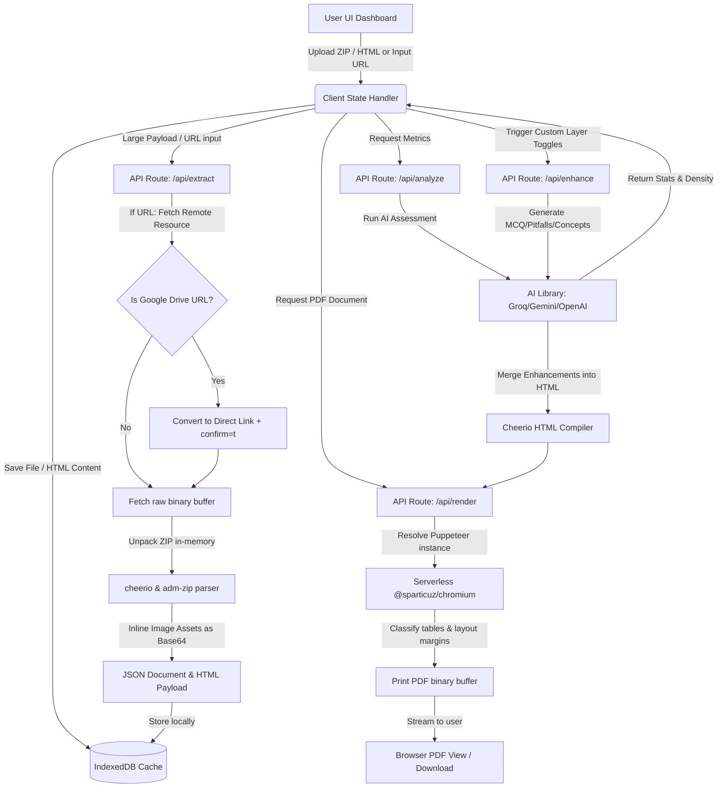

# 🎓 AI-Powered Study Guide Publishing Platform

An advanced, Next.js-based document parsing, enrichment, and publishing engine. It converts raw study materials (such as exports from Notion) into publication-grade, professionally branded PDF textbooks with AI-generated instructional layers—such as multiple-choice questions, revision boxes, common student pitfalls, and key exam concepts.

---

## 🚀 Key Capabilities

1. **Structured Parsing & Archive Unpacking**
   * **In-Memory ZIP extraction:** Processes uploaded ZIP files containing HTML and associated assets in-memory (utilizing `cheerio` and `adm-zip`), keeping the backend serverless execution completely stateless.
   * **Base64 Asset Inlining:** Scans references to external assets inside HTML (e.g. image attachments) and automatically inlines them as Base64 strings to ensure perfect rendering without disk dependencies.
   * **Local Image Resolution Fallback:** When running in development mode, automatically searches local directories to locate and inline images for standalone HTML files.

2. **Google Drive Integration & Bypass Support**
   * **Google Drive Downloader:** Supports uploading ZIP and HTML files directly from a URL.
   * **Security/Virus Scan Page Bypass:** Transparently translates regular Google Drive URLs into direct downloads and automatically appends `&confirm=t` query parameters to bypass Google's verification alerts for large files (>100KB), streaming raw binary buffers.

3. **Multi-Provider AI Enhancement (RAG & Assessment)**
   * **LLM Integrations:** Connects seamlessly with **Groq** (llama-3.3-70b-versatile), **Gemini** (gemini-1.5-flash), or **OpenAI** (gpt-4o-mini) with zero-config fallback to mock analytics when keys are omitted.
   * **Study Analytics:** Evaluates document difficulty levels (Beginner, Intermediate, Advanced), topic densities (percentage coverage), estimated reading times, word counts, and element counts.
   * **Educational Overlays:** Automatically generates and appends:
     * Learning objectives & chapter summaries.
     * High-yield exam concept definitions.
     * Common misconception and correction boxes.
     * High-quality Multiple Choice Questions (MCQs) with options and explanations.
     * Viva & interview Q&As.

4. **Branded Print & PDF Generation Engine**
   * **Puppeteer & Chromium Serverless Integration:** Leverages `@sparticuz/chromium-min` on Vercel deployment to boot Chromium and print pixel-perfect PDF manuals from HTML.
   * **Responsive Layout Classification:** Automatically parses page tables and images, dynamically classifying small tables (column-span: 1) and wide tables (column-span: all) to print correctly in A4 format.
   * **Branded Headers & Footers:** Places inlined corporate logo images, course breadcrumbs, contact lines, website URLs, and green-badge page counters onto every printed page with precise margin spacing.

5. **Serverless Scalability & Client-Side Caching**
   * **IndexedDB Store:** Leverages client-side IndexedDB caching via [db.ts](file:///Users/saieshwarrampelli/Downloads/LevelUp/ai-publishing-platform/src/lib/db.ts) to store raw files, document HTML, and enhancements, successfully bypassing localstorage/session storage string-size quotas.
   * **Vercel Body Limit Bypass:** Allows processing files larger than Vercel's 4.5MB request payload limit by resolving remote URL downloads server-side.

---

## 📊 Pipeline & Architecture Flow

The flowchart below outlines how an uploaded study document transitions from raw input to parsed state, undergoes AI enrichment, and is compiled into a branded PDF:



---

## 📂 Project Directory Structure

Use the links below to open and edit core source files:

* 📁 **[src/app/api](file:///Users/saieshwarrampelli/Downloads/LevelUp/ai-publishing-platform/src/app/api)** — Serverless API routes:
  * 📄 **[extract/route.ts](file:///Users/saieshwarrampelli/Downloads/LevelUp/ai-publishing-platform/src/app/api/extract/route.ts)** — Unpacks ZIP folders, retrieves remote URLs (bypassing Google Drive screens), and inlines assets.
  * 📄 **[analyze/route.ts](file:///Users/saieshwarrampelli/Downloads/LevelUp/ai-publishing-platform/src/app/api/analyze/route.ts)** — Extracts text parameters and retrieves document difficulty and density metrics.
  * 📄 **[enhance/route.ts](file:///Users/saieshwarrampelli/Downloads/LevelUp/ai-publishing-platform/src/app/api/enhance/route.ts)** — Requests custom learning objectives, pitfalls, and MCQ exercises.
  * 📄 **[render/route.ts](file:///Users/saieshwarrampelli/Downloads/LevelUp/ai-publishing-platform/src/app/api/render/route.ts)** — Orchestrates Puppeteer Chromium page loading, layout formatting, headers, footers, and PDF rendering.
  * 📁 **[download/[...slug]/route.ts](file:///Users/saieshwarrampelli/Downloads/LevelUp/ai-publishing-platform/src/app/api/download)** — Serves statically cached PDFs to client download triggers.

* 📁 **[src/lib](file:///Users/saieshwarrampelli/Downloads/LevelUp/ai-publishing-platform/src/lib)** — Core logic and utility scripts:
  * 📄 **[ai.ts](file:///Users/saieshwarrampelli/Downloads/LevelUp/ai-publishing-platform/src/lib/ai.ts)** — System prompt mapping and payload handlers for Groq, Gemini, and OpenAI API endpoints.
  * 📄 **[parser.ts](file:///Users/saieshwarrampelli/Downloads/LevelUp/ai-publishing-platform/src/lib/parser.ts)** — Parsing HTML headings, paragraphs, lists, tables, callouts, and combining AI overlays back into the document layout.
  * 📄 **[puppeteer.ts](file:///Users/saieshwarrampelli/Downloads/LevelUp/ai-publishing-platform/src/lib/puppeteer.ts)** — Browser initialization configuration for Vercel production environments vs local Google Chrome instance paths.
  * 📄 **[template.ts](file:///Users/saieshwarrampelli/Downloads/LevelUp/ai-publishing-platform/src/lib/template.ts)** — Primary CSS formatting layout, page borders, Notion background colors, bullet styles, and watermark containers.
  * 📄 **[db.ts](file:///Users/saieshwarrampelli/Downloads/LevelUp/ai-publishing-platform/src/lib/db.ts)** — IndexedDB client interface hooks for offline payload management.

* 📁 **[src/app/workspace](file:///Users/saieshwarrampelli/Downloads/LevelUp/ai-publishing-platform/src/app/workspace)**:
  * 📄 **[page.tsx](file:///Users/saieshwarrampelli/Downloads/LevelUp/ai-publishing-platform/src/app/workspace/page.tsx)** — Publishing Dashboard containing step-by-step upload fields, uploader logic, AI toggles, and metadata visualizers.

* 📁 **[src/app/preview](file:///Users/saieshwarrampelli/Downloads/LevelUp/ai-publishing-platform/src/app/preview)**:
  * 📄 **[page.tsx](file:///Users/saieshwarrampelli/Downloads/LevelUp/ai-publishing-platform/src/app/preview/page.tsx)** — Custom live PDF simulator rendering the document within the workspace before printing.

---

## 🛠️ Local Setup & Configuration

### 1. Prerequisites
* **Node.js** (v18 or higher recommended).
* **npm** (v9 or higher).
* **Google Chrome** installed in applications folder (for local Puppeteer rendering rendering).

### 2. Environment Setup
Create a `.env.local` file in the root directory and configure one of the supported AI APIs. If no keys are specified, mock data will be used automatically:

```env
# Groq (Recommended - Fast)
GROQ_API_KEY=gsk_your_groq_api_key

# Or Gemini (Fallback)
GEMINI_API_KEY=AIzaSyYourGeminiApiKey

# Or OpenAI (Fallback)
OPENAI_API_KEY=sk-proj-yourOpenAiApiKey
```

### 3. Installation
Install project dependencies:
```bash
npm install
```

### 4. Running the Development Server
Start the local server:
```bash
npm run dev
```
Open **[http://localhost:3000](http://localhost:3000)** in your browser. The platform's workspace dashboard can be accessed directly at **[http://localhost:3000/workspace](http://localhost:3000/workspace)**.

### 5. Running Production Builds
To test the production build locally:
```bash
npm run build
npm run start
```

---

## ⚙️ Key Technical Challenges Addressed

### A. Vercel 4.5MB API Body Payload Limit
To prevent API route failures from oversized files (e.g. ZIPs with rich media attachments), the application includes a **Download from Link** feature. The user supplies a URL, and the server fetches the file directly. The application also uses IndexedDB (`StudyGuideDB` store) to store document states on the client side, bypassing session storage limitations.

### B. Google Drive Direct Stream & Bypass
Google Drive shared links do not yield files directly. Instead, they present an HTML intermediate screen. For files >100KB, they present a virus-scanner confirmation page. The endpoint automatically matches Google Drive patterns, extracts the File ID, and converts the address:
```typescript
// Transforms: https://drive.google.com/file/d/FILE_ID/view
// Into direct stream: https://drive.google.com/uc?export=download&id=FILE_ID&confirm=t
```
The addition of `&confirm=t` bypasses Google's warnings and fetches raw bytes directly in-memory.

### C. Serverless Puppeteer Integration
Serverless functions on Vercel do not include native Chrome executable files, nor do they support large headless browser packages. The utility in [src/lib/puppeteer.ts](file:///Users/saieshwarrampelli/Downloads/LevelUp/ai-publishing-platform/src/lib/puppeteer.ts) solves this by:
* Launching local Chrome executable binaries on Mac/Linux environments in **Development**.
* Dynamically pulling and running a lightweight Chromium pack via URL in **Production/Vercel**:
  `https://github.com/sparticuz/chromium/releases/download/v131.0.1/chromium-v131.0.1-pack.tar`
